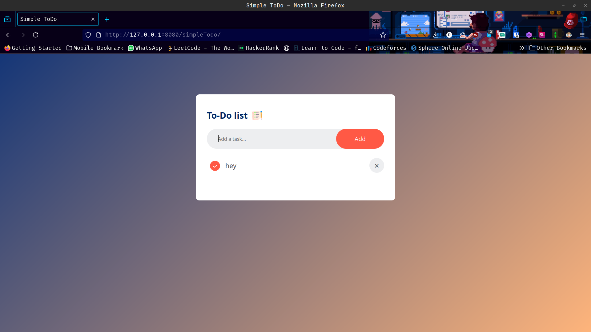

# Simple Todo App

This is a basic Todo application developed using HTML, CSS, and JavaScript.

## Features

- Add new tasks
- Mark tasks as completed
- Delete tasks
- Simple and intuitive user interface

## How to Use

1. Open the `index.html` file in your web browser.
2. Enter a task in the input field and click "Add" or press Enter to add it to the list.
3. Click on a task to mark it as completed.
4. Click the delete button next to a task to remove it from the list.

## Technologies Used

- HTML
- CSS
- JavaScript

## File Structure

- `index.html`: The main HTML file
- `styles.css`: Contains all the styles for the app
- `script.js`: Includes the JavaScript functionality

Enjoy using this simple Todo app!

## Screenshot

